# Minecarft（JE）を始める。 

こちらはMinecraft Java Edition version 1.17.1のMod導入手順書です。 
※対象OS：Windows10
___
- [Minecarft（JE）を始める。](#minecarftjeを始める)
  - [STEP1. Javaのインストール](#step1-javaのインストール)
    - [Java 16 をインストールする。](#java-16-をインストールする)
  - [STEP2. Forgeのインストール](#step2-forgeのインストール)
  - [STEP3. Modの適用](#step3-modの適用)
      - [MineAll](#mineall)
      - [DigAll](#digall)
      - [CutAll](#cutall)
    - [Modのダウンロード](#modのダウンロード)
    - [Minecraftの起動・Modの適用](#minecraftの起動modの適用)
  - [最後に](#最後に)
___
## STEP1. Javaのインストール
まずはお使いのPCにJavaがインストールされているか確認しましょう。
- Windowsタスクバーから「🔎」をクリック
- 「ここに入力して検索」という部分に __コマンドプロンプト__ と入力して、アプリを立ち上げる。
- コマンド内に`java -version`と入力

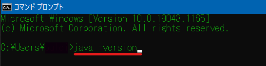

- 「内部コマンドまたは～」というメッセージが出た方はJavaがインストールされていないので[そのまま下にお進みください。](#java-16-をインストールする)
- `java version "〇〇.〇.〇"`と出て、尚且つ数字が __16.0.0__ を超えている方は[STEP2へお進みください。](#step2-forgeのインストール)
- 数字が __16.0.0を越えていない場合__ 、再度インストールする必要がありますので[下にお進みください。](#java-16-をインストールする)

### Java 16 をインストールする。
<a href="https://www.oracle.com/java/technologies/javase-jdk16-downloads.html" target="_blank">こちらから</a>Javaをインストールします。

- リンク先のページをスクロールして __Windows x64 Installer__ の画像の赤線部分をクリック

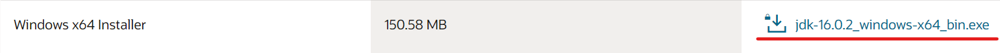

- 以下のようなメッセージが表示されるのでチェックボックスにチェックをつけてダウンロード開始

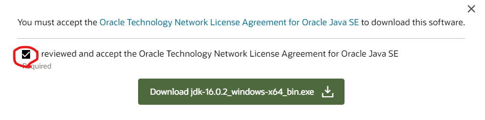

- ダウンロードされた __jdk-16.0.2_windows-x64_bin.exe__ というファイルをダブルクリックして実行します。
- 以下のようなものが立ち上がります。全て「次へ」を押してください。

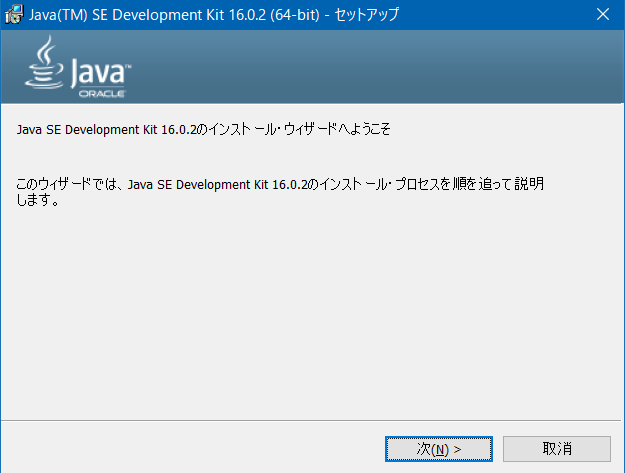

- 「正常にインストールされました」というメッセージが出たらインストール完了です。

___

## STEP2. Forgeのインストール

Modが利用可能なMinecraftの起動に必要となる「Forge」をインストールします。

- <a href="https://files.minecraftforge.net/net/minecraftforge/forge/" target="_blank">こちらのページ</a>を開いてください。
- 以下の赤線の部分をクリックします。

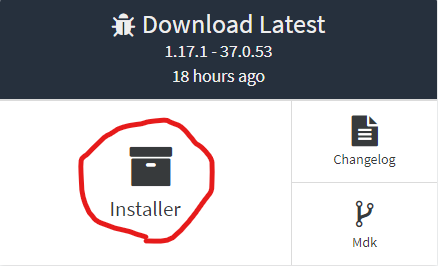

- 次のページに進み、数秒待つと __右上にスキップボタンが現れる__ のでそれをクリックしてダウンロードを開始します。
- ダウンロードした __forge-1.17.1-37.0.53-installer.jar__ というファイルを起動し、 __🔘Install client__ を選択して[OK]をクリック
- 以下のような画面が出ればインストール完了

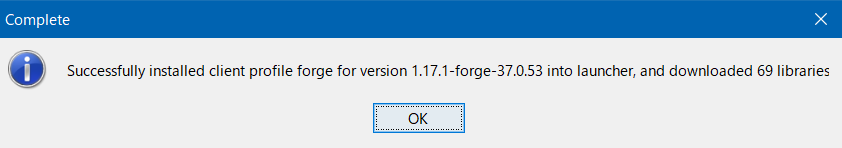

___

## STEP3. Modの適用

今回使ってみるModは以下の3つです。

#### MineAll
石・鉱石ブロックをまとめて破壊できるようにするMod

#### DigAll
土・砂・砂利などをまとめて破壊できるようにするMod

#### CutAll
原木などの木をまとめて破壊できるようにするMod

### Modのダウンロード

<a href="https://www.curseforge.com/minecraft/mc-mods/break-all-of-the-same-block-and-more/files/3430234" target="_blank">こちらのページ</a>を開いてください。

- 以下のダウンロードボタンをクリックします。

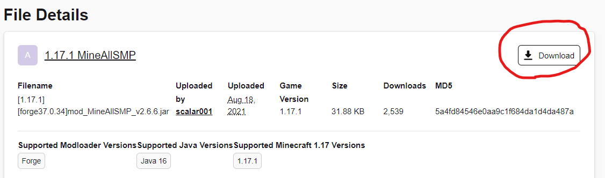

- 数秒待つとダウンロードが完了します。
※お使いのブラウザによっては警告メッセージが出ますが、 __保存__ を選択してください。

- 同様の手順で以下の二つのリンクからそれぞれDigAllとCutAllをインストールしてください。
- <a href="https://www.curseforge.com/minecraft/mc-mods/digall/files/3430240" target="_blank">DigAll</a>
- <a href="https://www.curseforge.com/minecraft/mc-mods/ikkatsuhakai-axe/files/3430238" target="_blank">CutAll</a>

### Minecraftの起動・Modの適用

__Minecraft Launcher__ を起動して、以下の画像の部分が __forge 1.17.1__ に切り替わっていることを確認してください。

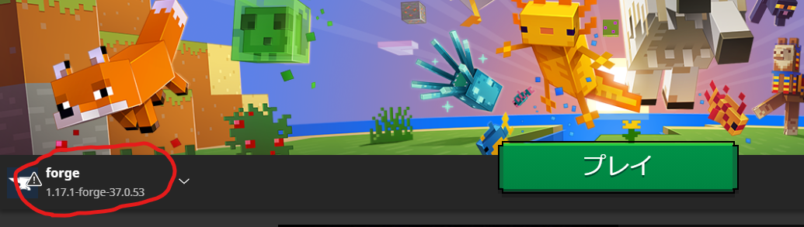

確認が出来たら、Minecraftを起動します。

- タイトル画面が開いたら、__Mod__ の部分をクリックし、 __Modフォルダを開く__ をクリックします。

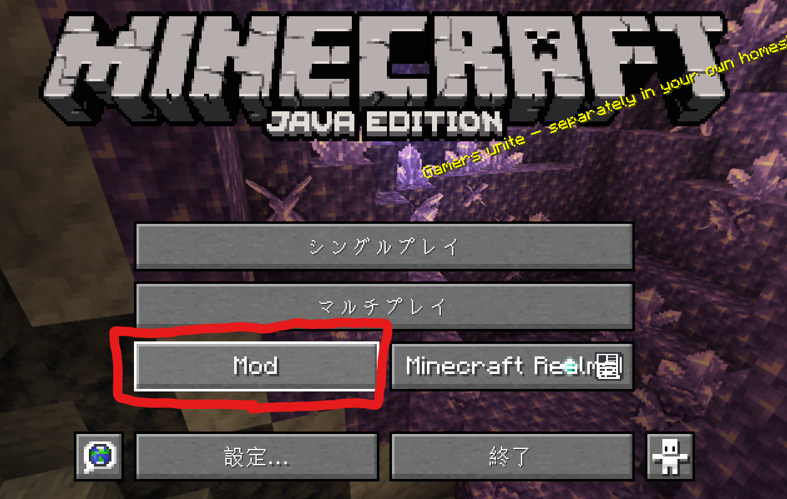
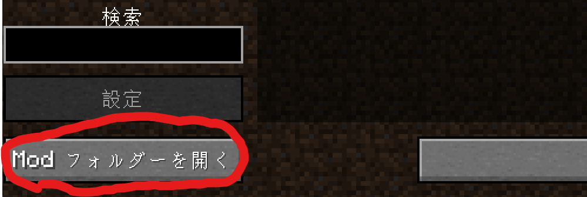

- このModファルダーに先ほどダウンロードしたModファイルを移動させます。
- 以下は移動させるファイル名
  - [1.17.1][forge37.0.34]mod_CutAllSMP_v2.5.2.jar
  - [1.17.1][forge37.0.34]mod_DigAllSMP_v2.3.3.jar
  - [1.17.1][forge37.0.34]mod_MineAllSMP_v2.6.6.jar

- 移動後はこんな感じ。
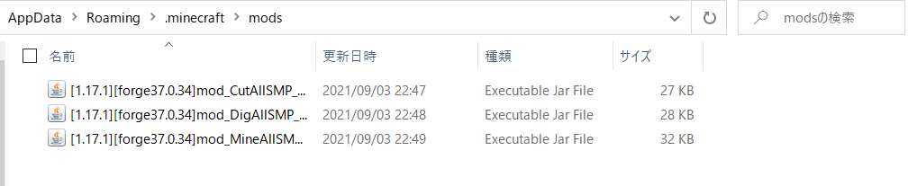

___

## 最後に
これでModの導入は完了しました。お疲れ様です。
今回導入してみたModは破壊系Modという便利Modです。
他にもModは沢山あり、いずれのModも今回のような手順で導入出来ます。
導入してほしいModなどありましたら気軽にお申し付けください。

うんぺろ

